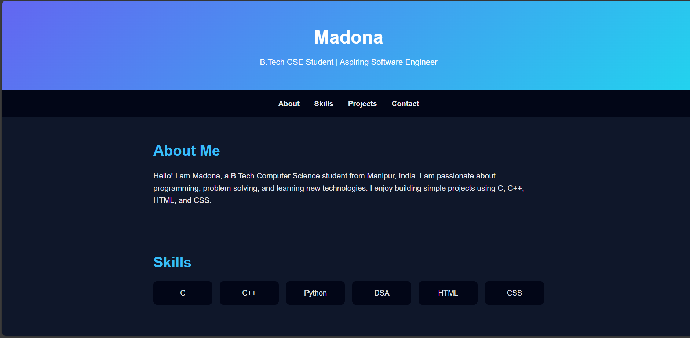

# Personal Portfolio Website

Welcome! This is my personal portfolio website where I showcase my skills, projects, and contact information.

## About Me
I am Madona, a B.Tech Computer Science student from Manipur, India.
I am passionate about programming, problem-solving, and learning new technologies.
I enjoy building simple projects using C, C++, HTML, and CSS.

## Skills
- C, C++, Python
- Data Structures & Algorithms
- HTML, CSS

## Projects
### Student Record Management System
A simple C++ program to store, display, and manage student records.

### Personal Portfolio Website
This portfolio website built using HTML and CSS. 

  

## Live Demo
[View Portfolio](https://madonamayengbam-web.github.io)

## Contact
- Email: [madonamayengbam13work@gmail.com](mailto:madonamayengbam13work@gmail.com)
- GitHub: [madonamayengbam-web](https://github.com/madonamayengbam-web)
- LinkedIn: [madona-mayengbam](https://www.linkedin.com/in/madona-mayengbam)

